# Windows Server 2022 Active Directory Home Lab

A self-directed home lab where I build and operate a small Windows enterprise
environment from scratch to develop hands-on Active Directory, DNS, and identity
skills for entry-level IT support and system administration roles.

> **Scope note:** This is a self-taught home lab built in my own time for
> learning and interview preparation. It is not paid or on-the-job experience.
> Everything here was built, broken, and fixed by me in VirtualBox.

---

## Why I built this

Job ads for IT support and junior sysadmin roles list Active Directory, Group
Policy, and Windows Server as day-one expectations, but they are hard to
practise without access to a real corporate environment. So I built one. This
lab lets me perform the same identity tasks a help desk does daily — creating
users, resetting passwords, handling lockouts, and managing group-based access —
and document each step the way a real technician would.

The project is split by day so each session is a self-contained, dated piece of
work:

- **Day 1 (this page)** — Build the Domain Controller and complete the core
  identity setup.
- **Day 2** — Join a Windows 11 client, run the live lockout lifecycle, and push
  a Group Policy banner to the client. *(See the Day 2 write-up in `/docs`.)*

---

## Lab environment

| Component | Detail |
|---|---|
| Hypervisor | Oracle VirtualBox 7.2 (host: 16 GB RAM) |
| Domain Controller | DC01 — Windows Server 2022 Standard (Eval), Desktop Experience, 4 GB / 2 vCPU / 60 GB |
| Networking | Static IP `10.0.2.15` /24, DNS pointed to self |
| Domain | New forest `corp.lab.local` (NetBIOS: CORP) |

---

## Day 1 — what I did

### 1. Built the Domain Controller

Installed Windows Server 2022 from scratch, set a static IP with DNS pointed at
itself, renamed the server to DC01, installed the AD DS role, and promoted it to
a Domain Controller in a new forest, `corp.lab.local`. DNS installed
automatically as part of the promotion.

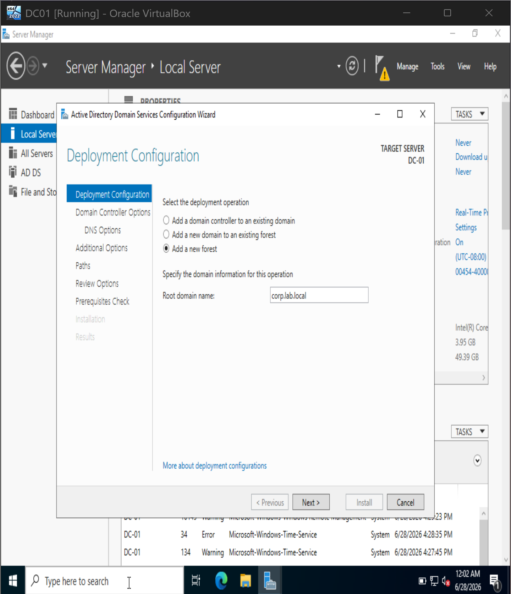
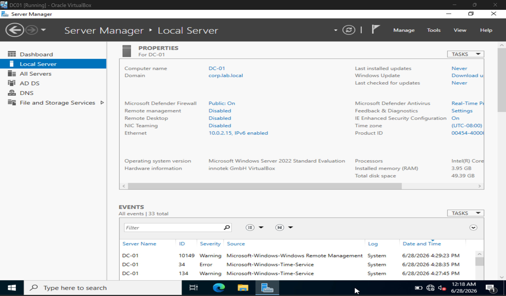

*Why it matters:* a Domain Controller needs a fixed IP and self-DNS **before**
promotion — Active Directory relies on DNS to locate its own services.

### 2. Organised the directory with an OU structure

Built an Organizational Unit tree — `CORP > Users, Groups, Computers,
Departments > IT, Sales` — with accidental-deletion protection left on.

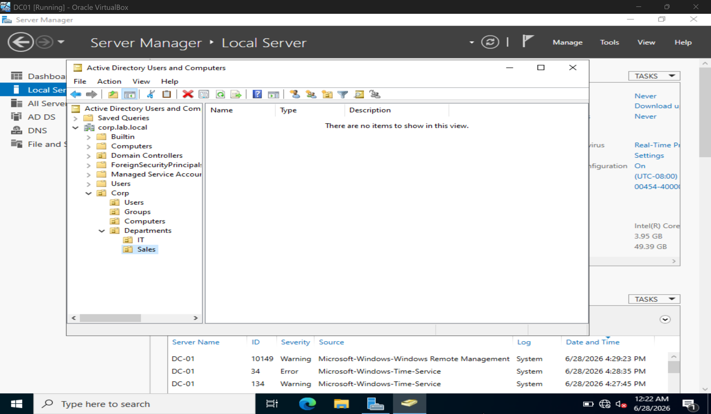

*Why it matters:* real environments use OUs to organise objects and to target
Group Policy, rather than dropping everything in the default Users container.

### 3. Created a user (the "new starter" ticket)

Created `alex.taylor` in the IT OU using the `firstname.lastname` convention,
with "user must change password at next logon" enabled.

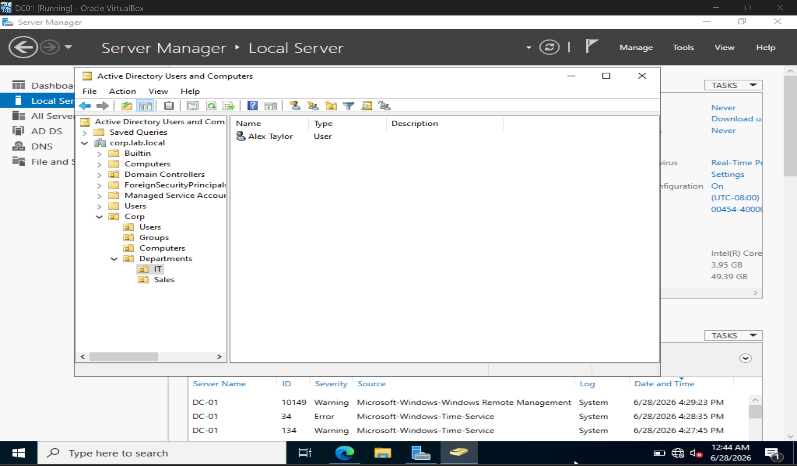

*Why it matters:* this mirrors the standard new-starter account ticket — the
user sets their own password on first login, so the technician never knows it.

### 4. Set an account lockout policy

Set the account lockout threshold to 3 invalid attempts via the Default Domain
Policy.

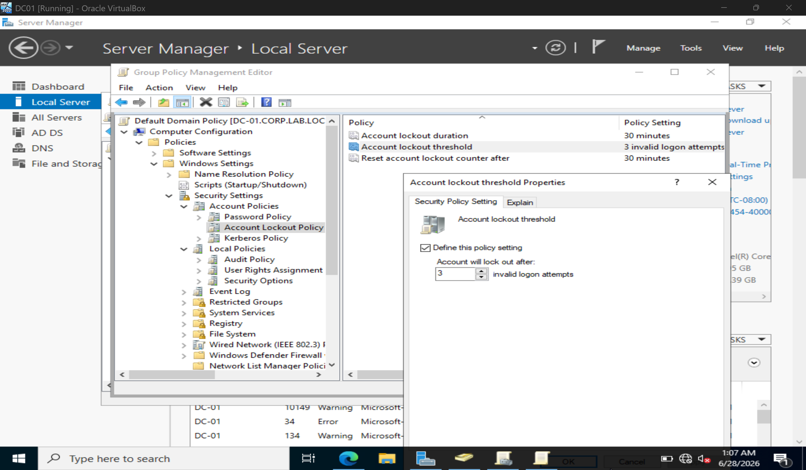

*Why it matters:* this makes lockouts behave realistically and is the basis for
handling "I'm locked out" tickets (tested live in Day 2).

### 5. Granted access with a security group

Created a Global Security group, `IT-Staff`, and added `alex.taylor` as a member.

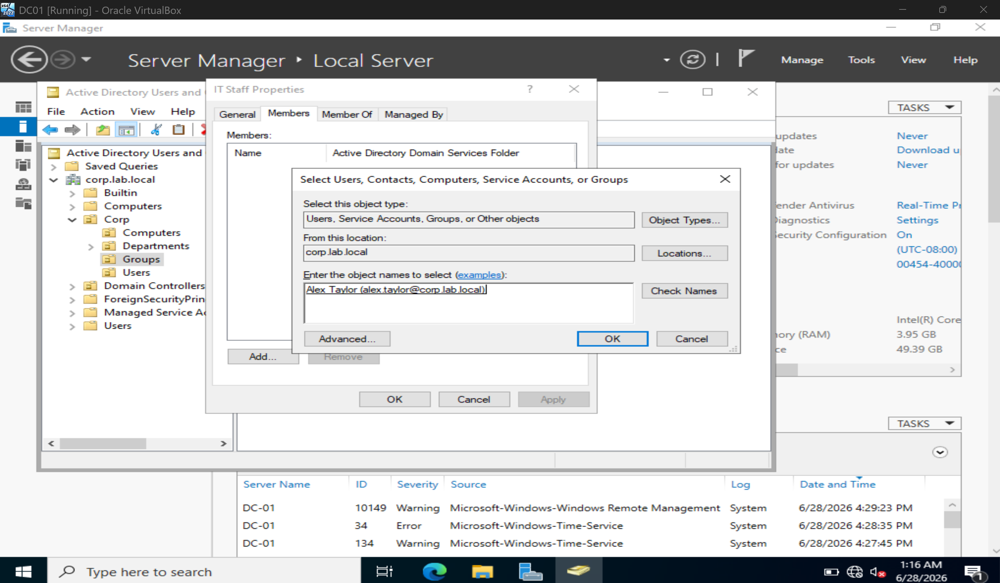
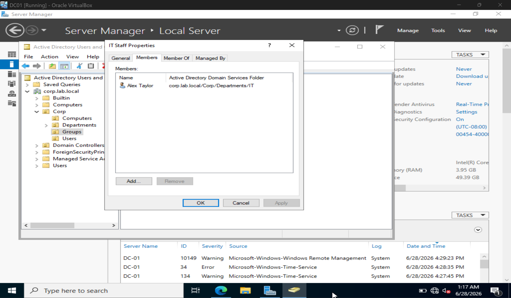

*Why it matters:* access is granted through group membership, not per-user — the
standard approach in any managed environment.

---

## Skills demonstrated

Active Directory Domain Services · DNS fundamentals · Windows Server 2022 setup ·
static IP configuration · OU design · user lifecycle (create / reset / unlock) ·
account lockout policy · security groups · VirtualBox virtualisation.

## Full write-up

The complete step-by-step Day 1 summary, including the reasoning behind each
task, is in [docs/Home_Lab_Day1_Summary.pdf](docs/).

## Next session

**Day 2** — Build a Windows 11 Pro client, join it to `corp.lab.local`, run the
full lockout lifecycle end to end (forced password change -> real lockout ->
unlock from the DC), and create a Group Policy logon banner applied to the
client. After that: a Microsoft 365 Developer tenant and Entra ID, repeating the
same identity tasks in the cloud.

---

# Home Lab — Day 2: Domain-Joined Client, Live Lockout & Group Policy

Day 2 of my self-directed Active Directory home lab. In Day 1 I built the Domain
Controller and set up identity. In Day 2 I prove it all works: I join a Windows 11
client to the domain, run the full account-lockout lifecycle end to end, and push
a Group Policy setting out to the client.

> **Scope note:** Self-taught home lab, built in my own time for learning and
> interview preparation. Not paid or on-the-job experience. Everything here was
> built, broken, and fixed by me in VirtualBox.

*(This is the continuation of [Day 1](../). Read that first for the domain build.)*

---

## What Day 2 adds

Day 1 built the domain "on paper" — a Domain Controller, users, a lockout policy,
and a security group. But none of it had been tested against a real machine. Day 2
introduces a client computer so every setting becomes observable: a lockout you can
actually trigger, and a policy you can actually see appear on screen.

---

## Lab environment (additions for Day 2)

| Component | Detail |
|---|---|
| Client | CLIENT01 — Windows 11 Pro, 4 GB / 2 vCPU / 60 GB, EFI + TPM 2.0 |
| Client network | Static IP `10.0.2.20`, DNS pointed at the DC (`10.0.2.15`) |
| Connectivity | Both VMs on a VirtualBox Internal Network — isolated, no internet |

Pointing the client's DNS at the Domain Controller is the critical step — without
it, the client can't find the domain to join.

---

## Day 2 — what I did

### 1. Joined a Windows 11 client to the domain

Built CLIENT01 (Windows 11 Pro), gave it a unique static IP with DNS pointed at
the DC, and joined it to `corp.lab.local` using domain admin credentials. After the
join, the test user `alex.taylor` can log in to this machine with their domain
account.

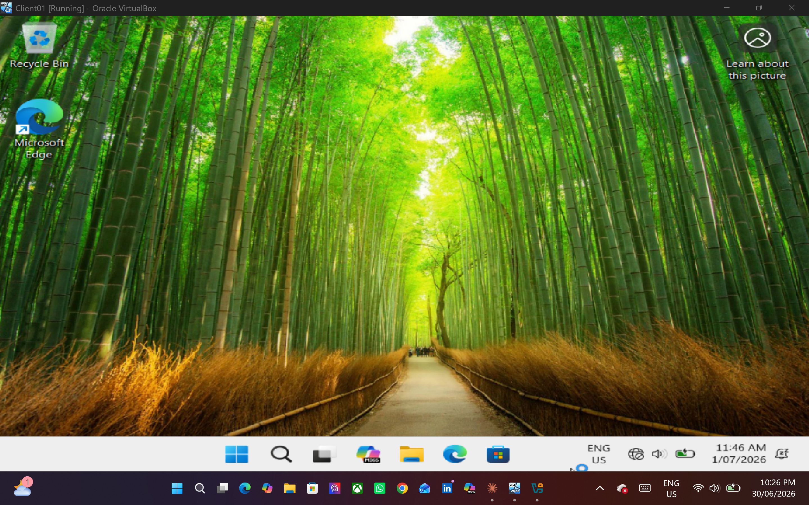

*Why it matters:* joining a new starter's PC to the domain is one of the most
common hands-on sysadmin tasks. The client validates the login against the DC, not
locally.

### 2. Ran the account-lockout lifecycle end to end

Logged in as `alex.taylor` (who was forced to change their password on first
logon), then deliberately entered the wrong password 3 times to trigger a real
lockout. Back on the DC, Active Directory Users and Computers confirmed the account
was locked, and I cleared it with the "Unlock account" option.

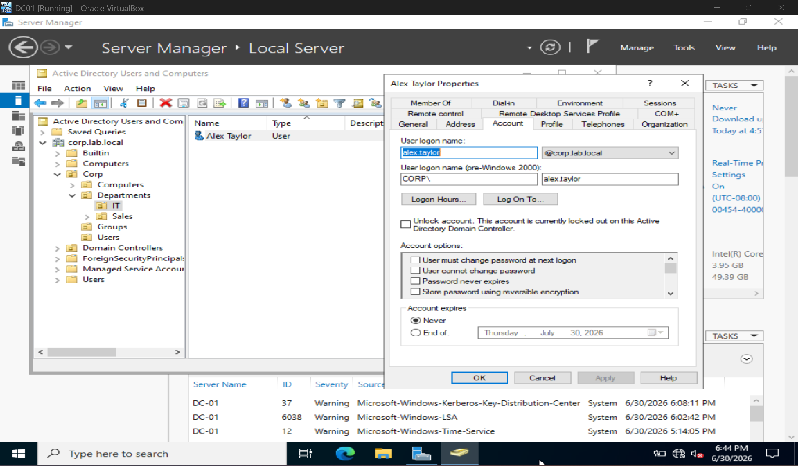

*Why it matters:* this is the complete "I'm locked out" ticket — the single most
common Level 1 help desk job — performed from the user hitting the lockout through
to the admin unlocking it. The lockout only behaves this way because of the
3-attempt policy set in Day 1.

### 3. Created a Group Policy Object

In Group Policy Management, created a new GPO named "Logon Banner" and linked it to
the domain.

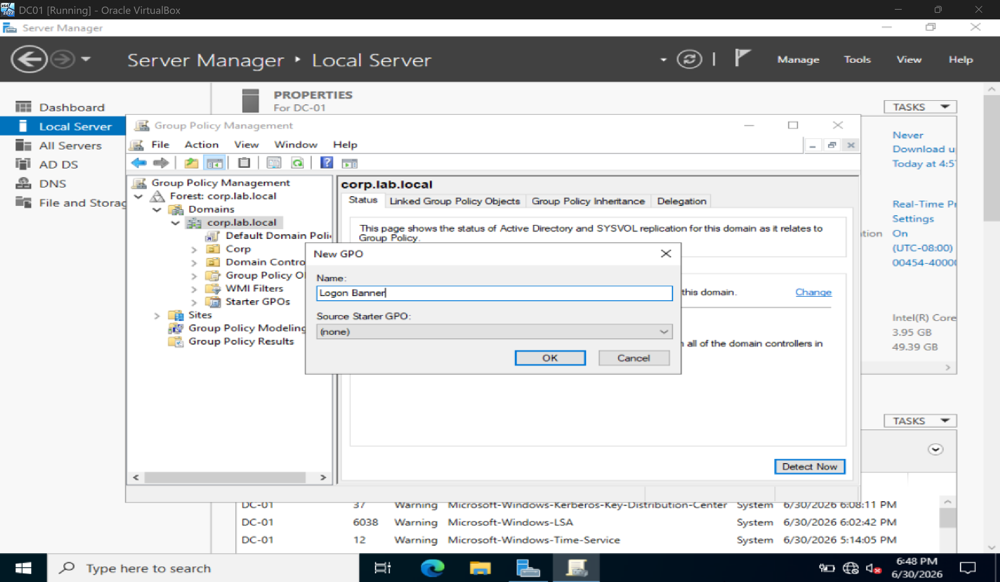

### 4. Configured the logon banner

Set two interactive-logon security settings: the message **title** ("Lab Notice")
and the message **text** ("Autorised users only. This is a lab environment.").

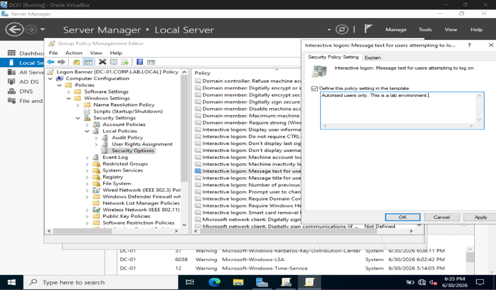
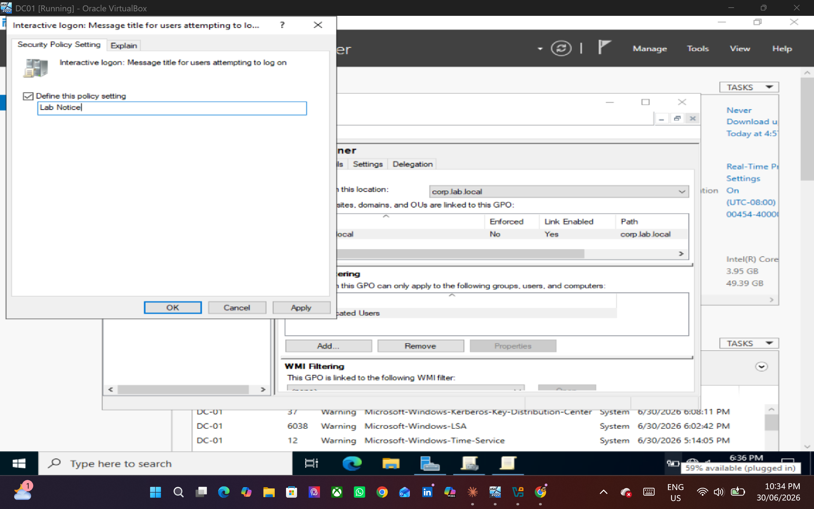

*Why it matters:* logon banners are a real security/compliance control — many
organisations are required to display an authorised-use notice before login.

### 5. Applied the policy and confirmed it on the client

On CLIENT01, ran `gpupdate /force` to pull the new policy immediately instead of
waiting for the automatic refresh, then confirmed the banner appears at logon.

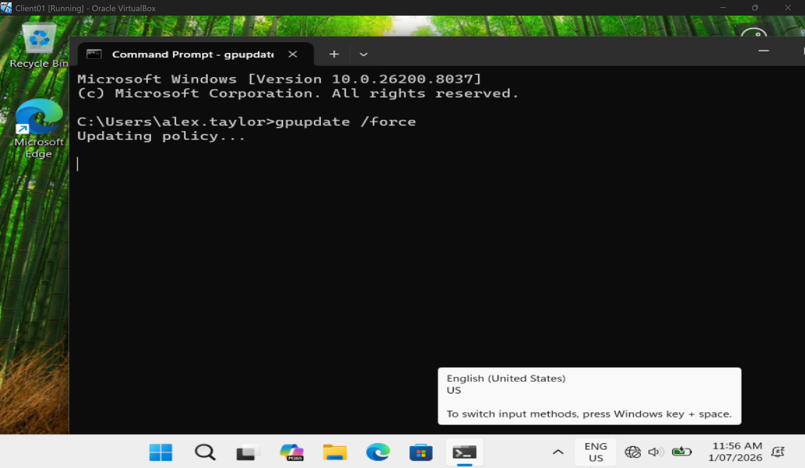
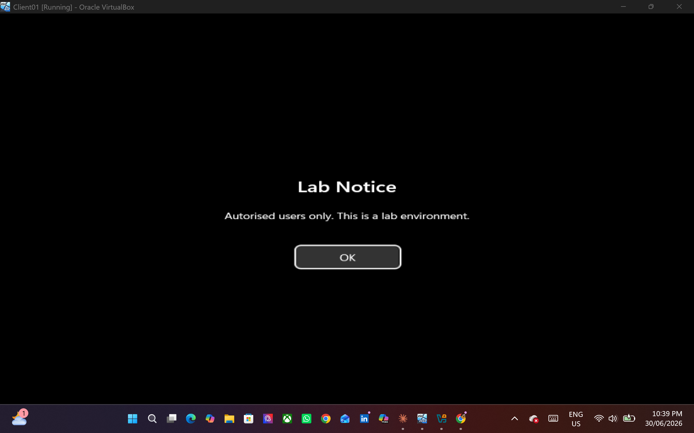

*Why it matters:* this closes the loop — a setting made once on the DC is enforced
on a managed machine. `gpupdate /force` is the everyday command for "apply my
change now."

---

## Problems I hit and how I solved them

- **Windows 11 wouldn't install** — it requires TPM 2.0 and Secure Boot; enabled
  both in the VM's firmware settings.
- **UEFI black screen on first boot** — the empty disk had no bootloader, so the
  firmware wouldn't fall through to the install media; fixed the boot order.
- **Forced Microsoft account during setup (OOBE)** — bypassed by disconnecting the
  network so Windows allowed a local account.
- **Client couldn't reach the domain** — it had accidentally been given the DC's IP;
  corrected it to a unique static IP with DNS pointed at the DC.

---

## Concepts learned

- A client must use the Domain Controller as its DNS server to locate and join the
  domain.
- Domain authentication is validated against the DC, not the local machine.
- Group Policy applies automatically at boot/logon and refreshes roughly every 90
  minutes; `gpupdate /force` (or `Invoke-GPUpdate` remotely) applies it on demand
  without waiting.

---

## Skills demonstrated

Domain join · account lockout troubleshooting (end to end) · Active Directory Users
and Computers · Group Policy creation and linking · GPO security settings ·
`gpupdate /force` · Windows 11 provisioning · DNS-for-domain configuration ·
VirtualBox internal networking.

## Full write-up

The complete step-by-step summary is in
[docs/Home_Lab_Day2_Summary.pdf](docs/).

## Next session

**Day 3** — Move to the cloud: sign up for a Microsoft 365 Developer tenant and
repeat the core identity tasks (user creation, password reset, lockout) in
**Entra ID**, then explore how on-prem and cloud identity connect (hybrid
concepts).

---

*Built and documented by Mertcan (Matt) Alkaya — Brisbane, QLD.*

